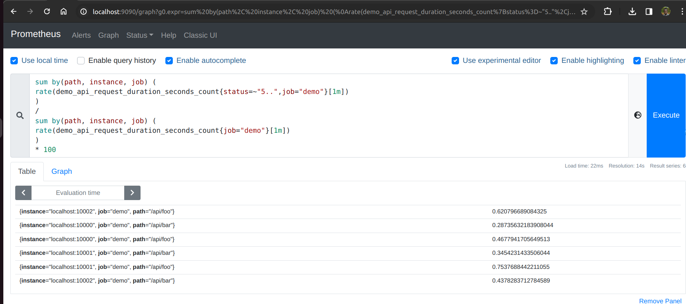

Lab 16.3 - Configuring Alerting Rules

Let’s configure some example alerting rules in Prometheus based on the metrics of the demo service
that your Prometheus server is already monitoring.

Let's say you wanted to alert on HTTP paths that have a 5xx error rate percentage larger than 0.5%.
You can try graphing the following expression to see that some paths actually sometimes have a
higher error rate than 0.5%:

sum by(path, instance, job) (
rate(demo_api_request_duration_seconds_count{status=~"5..",job="demo"}[1m])
)
/
sum by(path, instance, job) (
rate(demo_api_request_duration_seconds_count{job="demo"}[1m])
)
* 100

To tell Prometheus to load alerting rules from a file called alerting_rules.yml, add the following
section to the top level of your prometheus.yml:

rule_files:
- alerting_rules.yml