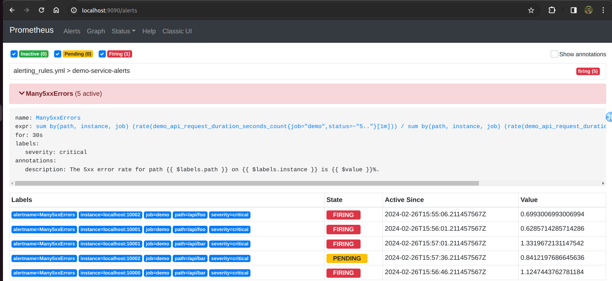
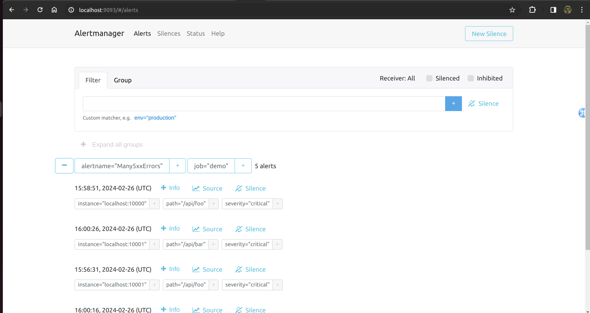
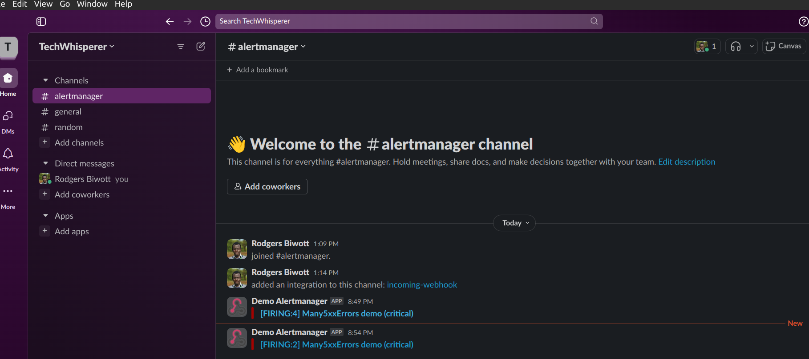

Lab 16.4 - Configuring Prometheus to Send Alerts to
Alertmanager

To tell Prometheus to send alerts to your Alertmanager, configure its address statically in an
alerting section at the top level of the prometheus.yml configuration file (note that you could also
use service discovery here):

alerting:
alertmanagers:
- static_configs:
- targets: ['localhost:9093']

Reload the Prometheus configuration by sending a HUP signal to the Prometheus process:

killall -HUP prometheus

Now head to http://<machine-ip>:9090/alerts to verify that an alerting rule is defined and
eventually shows firing alert entries when some of the error rates are higher than 0.5% (click on the
Many5xxErrors alert name to expand the details):

Once an alert is firing, you should also be able to see it in the Alertmanager web interface at
http://<machine-ip>:9093/:

