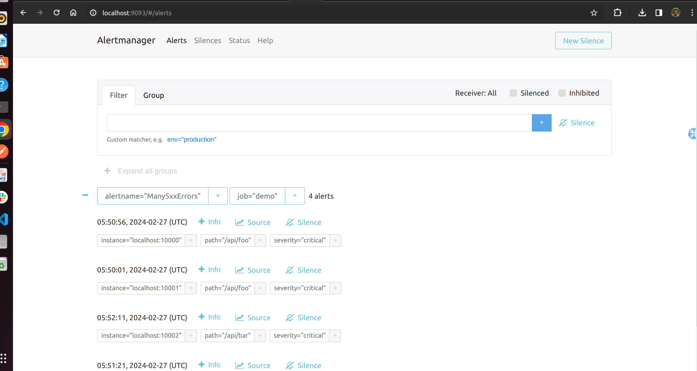
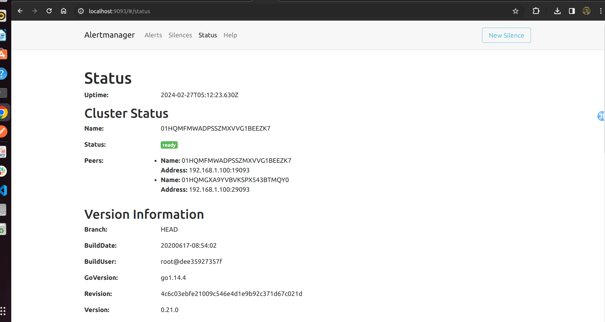
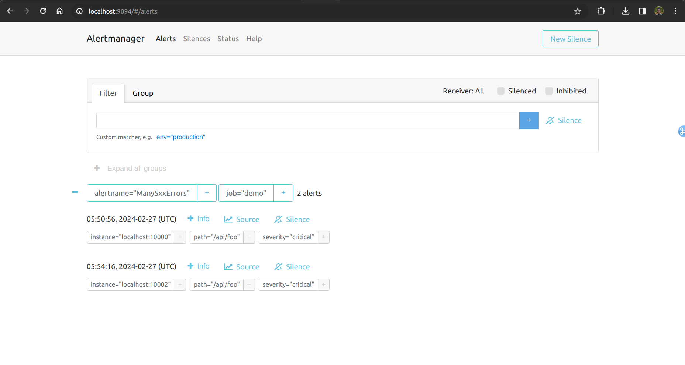
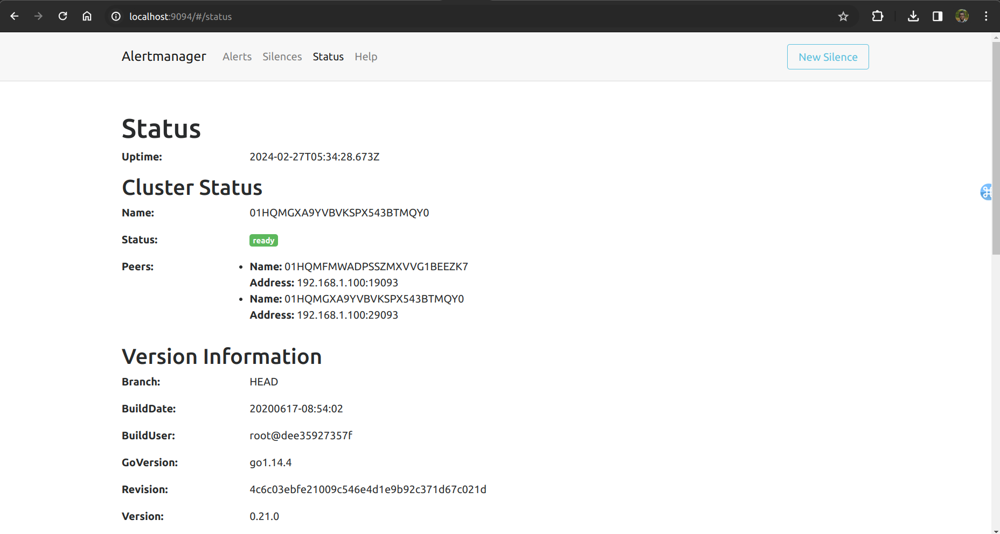

Lab 16.5 - Setting Up Alertmanager in HA Mode

In this lab, you will set up Alertmanager in HA mode.

Stop your existing Alertmanager with <Ctrl>+C if it's still running.
In two separate terminals, start two Alertmanager instances A and B that are configured as a meshed
highly available cluster:

./alertmanager --cluster.listen-address="0.0.0.0:19093"
--cluster.peer="localhost:29093" --storage.path=data-a
...and:

./alertmanager --cluster.listen-address="0.0.0.0:29093"
--cluster.peer="localhost:19093" --web.listen-address=:9094
--storage.path=data-b

Note how both instances configure the respective other instance as a cluster peer using the
--cluster.peer flag. This causes them to automatically gossip notification and silence state
information to the other instance.

Change the alerting section in your prometheus.yml to the following to send alerts to both of the
new Alertmanagers:

alerting:
alertmanagers:
- static_configs:
- targets:
- 'localhost:9093'
- 'localhost:9094'

Reload the Prometheus configuration by sending a HUP signal to the Prometheus process:
killall -HUP prometheus

The alerts should now appear in both Alertmanager instances, but you should only get one notification for each alert group. Also try creating a silence in the web interface of one of the Alertmanager
instances.

The silence should then automatically also appear in the second instance.
Try taking down one of the Alertmanager nodes (using <Ctrl>+C) and verify that alerting still works.

Ifyou delete the terminated Alertmanager’s data directory (data-a or data-b) and start it up again, it
should re-replicate both the notification states and silences.

