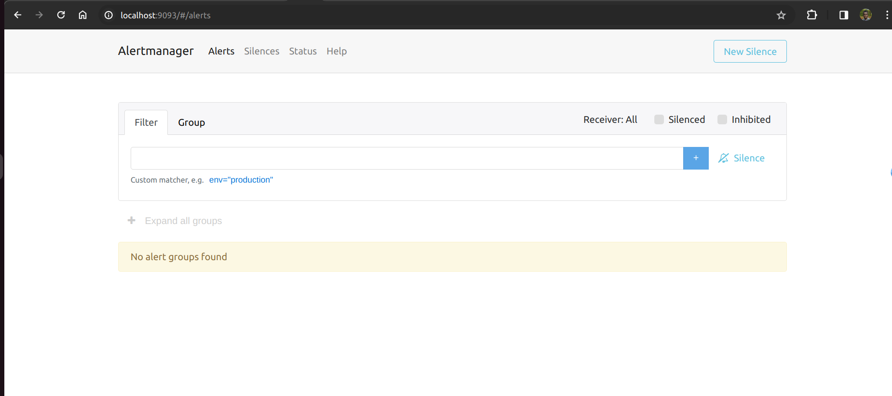

Lab 16.2 - Starting Alertmanager

In the terminal in which you downloaded and configured Alertmanager, start Alertmanager:

./alertmanager --cluster.listen-address="" --log.level=debug

This disables the cluster port that Alertmanager listens on for peer gossip notifications, as this is only
relevant when running Alertmanager in a highly available cluster (you will learn about high availability
later). It also enables debug logging, as certain notification failures are only logged at that level.

In a browser, head to http://<machine-ip>:9093/ to view the Alertmanager’s web interface.

The web interface should not show any active alerts, as you have not configured any Prometheus
server to send alerts to it yet.

