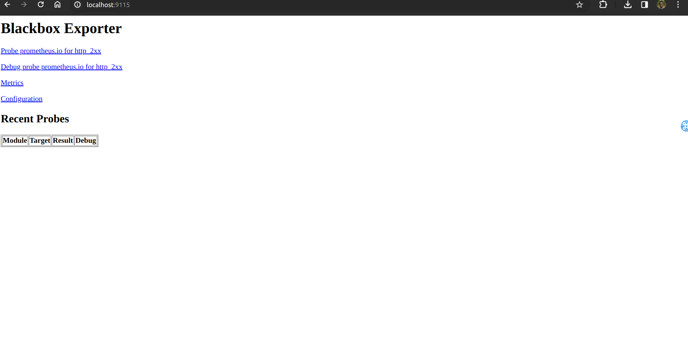

The Blackbox Exporter is a tool designed to probe network endpoints and collect metrics related to their accessibility and responsiveness. It is a component of the Prometheus monitoring system, which focuses on time-series-based monitoring and alerting. The Blackbox Exporter is specifically designed for probing endpoints, such as HTTP, HTTPS, ICMP (ping), TCP, and more, to provide insights into the reachability and performance of those endpoints.

Lab 14.1 - Setting Up Blackbox Exporter

In a new terminal, change into your home directory and download Blackbox Exporter 0.18.0 for Linux:

wget
https://github.com/prometheus/blackbox_exporter/releases/download/v0.18.0/blackb
ox_exporter-0.18.0.linux-amd64.tar.gz

Extract the tarball:

tar xvfz blackbox_exporter-0.18.0.linux-amd64.tar.gz

Change into the extracted directory:

cd blackbox_exporter-0.18.0.linux-amd64

Note: The timeout for a probe from the Blackbox Exporter to a backend target needs to be smaller
than Prometheus’s own timeout when scraping the exporter. Otherwise, Prometheus will see the
Blackbox Exporter as down (with an up metric value of 0), instead of receiving information about the
backend target being down.

Start the Blackbox Exporter:

./blackbox_exporter

By default, the Blackbox Exporter will read its configuration from blackbox.yml and it will listen on
port 9115. Try heading to
http://<machine-ip>:9115/probe?target=https://prometheus.io&module=http_2xx
to see an example metrics output for an HTTP probe against https://prometheus.io.

