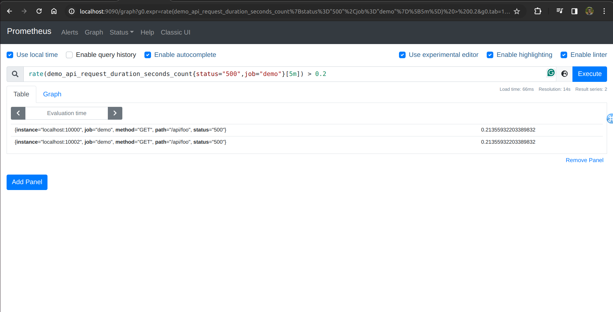
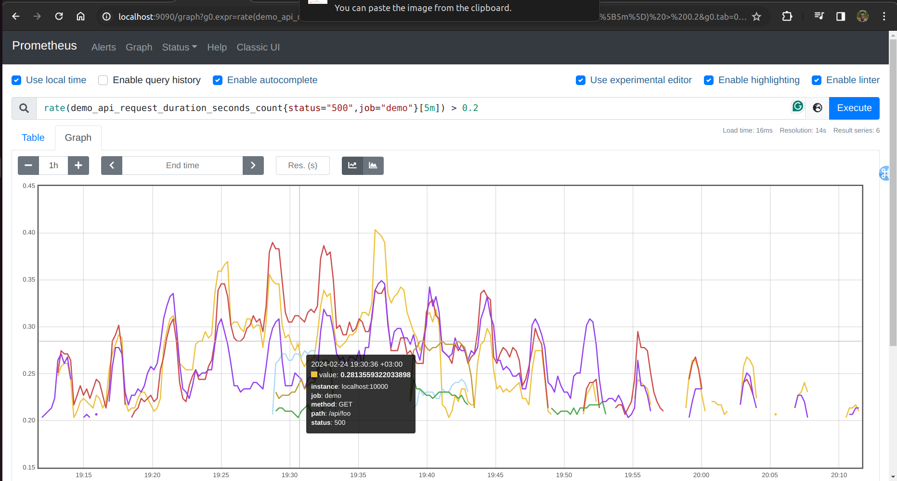
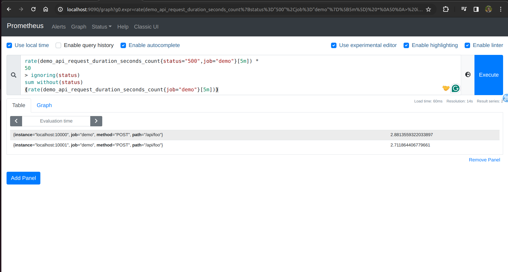
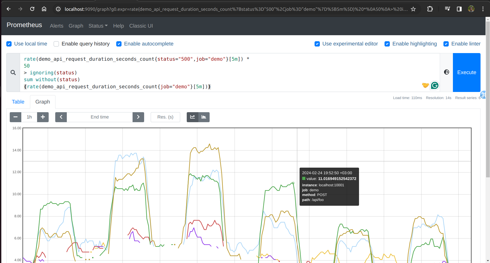

Lab 11.2 - Filtering by Sample Value
You already learned earlier how to select series by their metric name and label values. Sometimes you
will want to filter series by their sample value as well. The most obvious use case for this is for
thresholds in alerting expressions.
PromQL allows you to do this by adding a binary comparison operator between a time series vector
and a scalar number. For example, to select only the request rates for status="500" errors that are
above 0.2 per second, you can query for:

rate(demo_api_request_duration_seconds_count{status="500",job="demo"}[5m]) > 0.2

The result should look like this:

Filtering error rates by sample value

This works similarly for other comparison operators you may be used to from programming languages:
<, <=, >=, !=, and ==.
You can also compare entire sets of time series with the same label-matching behavior that arithmetic
binary operators have. This can be useful to correlate commonly labeled series. For example, the
following query selects all status="500" error rates that are at least 50 times larger than the total
traffic for a given path, method, and instance combination:

rate(demo_api_request_duration_seconds_count{status="500",job="demo"}[5m]) *
50
> ignoring(status)
sum without(status)
(rate(demo_api_request_duration_seconds_count{job="demo"}[5m]))

The result should look like this (you may see more or fewer series, depending on current request and
error rates):

