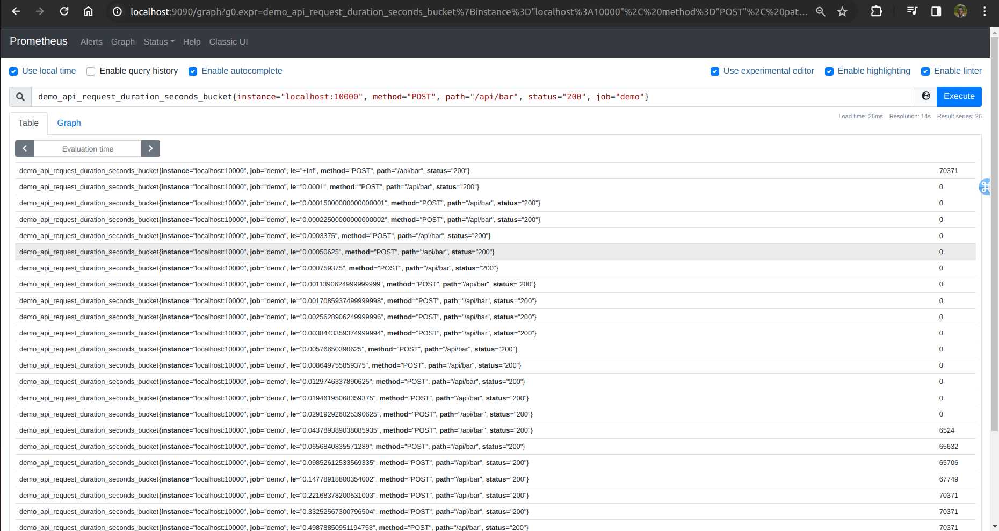
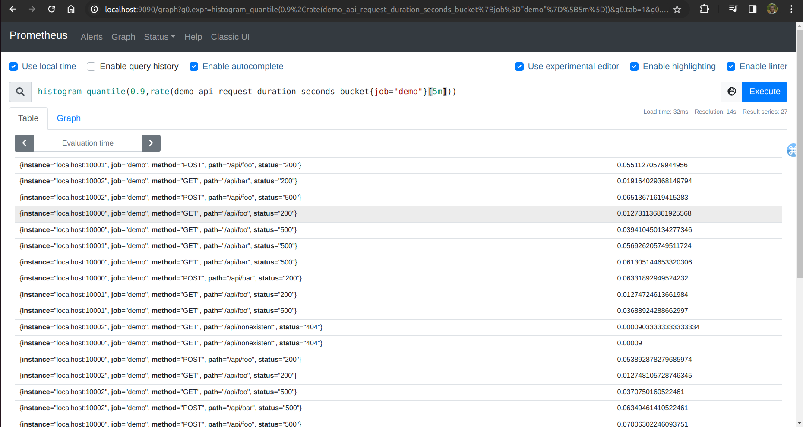
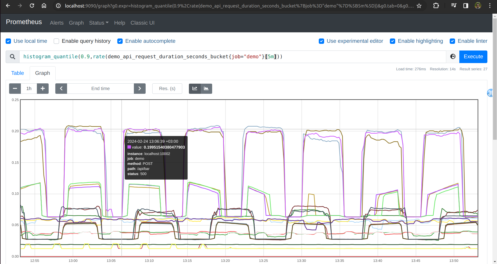
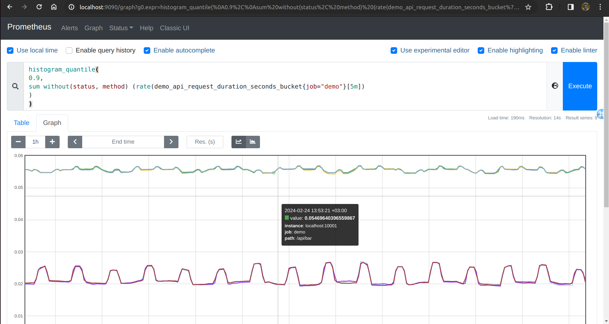

Lab 11.1 - Histograms and Calculating Quantiles
We already briefly mentioned histograms when instrumenting an example service. Histograms are a
metric type that allow you to track the distribution of a set of values (like request durations) by
categorizing the values into range buckets and counting how many events of each bucket type an
application has observed so far. Prometheus histograms are cumulative, meaning that each bucket
also contains the counts of previous buckets with lower range boundaries. Most frequently, histograms
are used to track durations of operations like HTTP requests, so the first bucket might count request
durations from 0 to 50ms, the next one 0 to 100ms, and so on. Finally, Prometheus histograms always
contain a bucket that ranges from 0 to infinite, effectively counting all observed values (this is
equivalent to just counting all requests that have occurred).
In Prometheus, histogram metrics are exposed as multiple time series (one for each bucket) with a
_bucket metric name suffix and an le label that indicates the upper bucket boundary (le stands for
"less than or equal"). Additionally, you may see unrelated label dimensions on the series that were
added by the instrumentation user. Each combination of other labels will contain its own
"sub-histogram", or full set of possible le bucket label values.
To see how this looks in practice, use the Table view in the expression browser to query for only the
sub-histogram of the request durations for a particular combination of instance, method, path, and
status labels:
demo_api_request_duration_seconds_bucket{instance="localhost:10000",method="POST
",path="/api/bar",status="200",job="demo"}
This will give you 26 output time series since the histogram has 26 buckets. The le label values will
look a bit erratic, as they were auto-generated by a library helper function

Querying a sub-histogram for a given path, method, instance, and status code

While a histogram gives you an idea of the distribution of request durations or can tell you how many
of your requests take longer than e.g. 50ms to complete (provided you have a bucket with an upper
boundary of 50ms), you often want to calculate quantiles (a more general form of percentiles) from
them. For example, you might want to know in which time at least 99% of your requests complete.
In PromQL, you can compute quantiles from a histogram using the histogram_quantile()
function. This function takes a desired quantile value as the first parameter and a histogram (set of
series labeled with le labels) as the second parameter. Note that the quantile value has to be between
0 and 1, which would correspond to the percentiles 0 and 100.
To calculate the 90th percentile request latency in the demo service as measured over the last 5
minutes, query for:
histogram_quantile(0.9,
rate(demo_api_request_duration_seconds_bucket{job="demo"}[5m]))
You should see a detailed breakdown:

Graphing the 90th percentile latency for every sub-dimension

Note: It is important to take the rate() of a histogram before calculating quantiles from it. This
ensures that only the bucket increases of the last e.g. 5 minutes are taken into account. Otherwise,
you would get quantiles averaged over the entire lifetime of the bucket counters, not the latency "right
now".
The above still gives you a detailed drill-down of 90th percentiles for every sub-dimension (path,
method, etc.). Often you want to aggregate some dimensions away and just see an overall system
latency. The good news is that all sub-histograms of a given histogram metric have the same bucket
configuration, and each bucket is just a counter. This means that you can just sum up the
corresponding bucket increase rates over a given set of dimensions to arrive at a valid aggregated
histogram (which we can then feed into histogram_quantile()).
For example, to calculate the 90th percentile latency with the status and method dimensions
aggregated away, query for:

histogram_quantile(
0.9,
sum without(status, method) (rate(demo_api_request_duration_seconds_bucket{job="demo"}[5m])
)
)

Graphing an aggregated 90th percentile latency

Note: Be careful to not aggregate away the le label. The histogram_quantile() function requires
this label to be present to interpret the histogram buckets.
This kind of query allows you to choose the quantile, the aggregation level, as well as the time to
average over when computing quantiles from histograms.
Since Prometheus histograms have a limited number of buckets (since each bucket incurs a cost in
the number of time series), there will always be an error associated when converting histograms into
quantile values. You can find details about this in the Prometheus documentation on errors of quantile
estimation.
