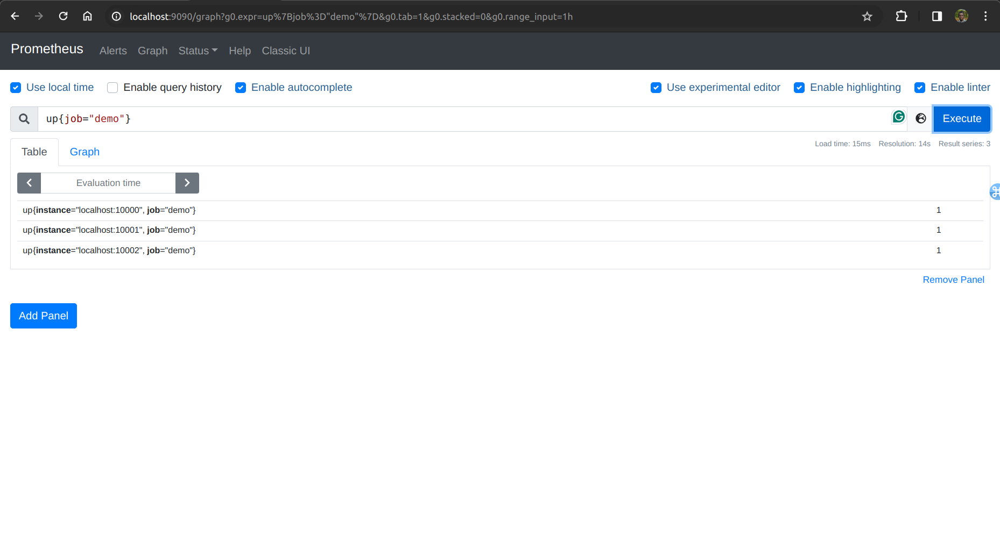
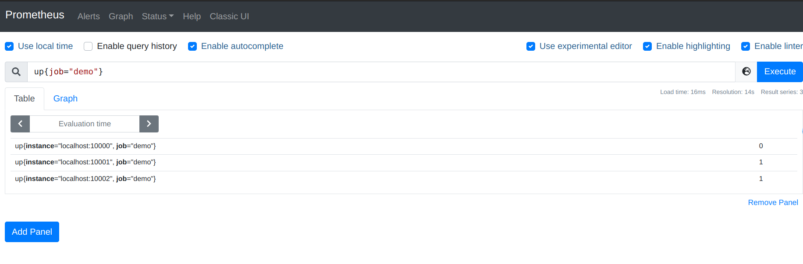
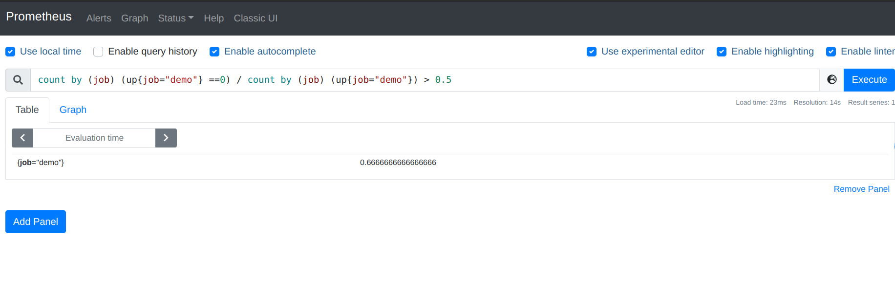
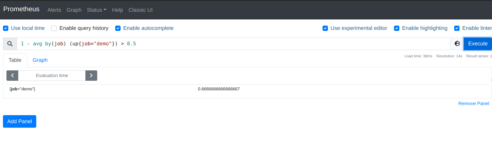

Lab 11.7 - Inspecting Scrape Health

Since Prometheus is a pull-based system, it notices when it cannot scrape a target and records this
fact in a metric. For every scrape, Prometheus records a synthetic up metric with the labels of the
scrape target. It sets the sample value to 1 if the scrape succeeded and to 0 if the scrape failed for
whatever reason. You can use this fact to query basic availability information about each job's targets.
Verify that all instances of the demo service are up by querying:

up{job="demo"}

All three instances should have a sample value of 1, meaning that they could all be scraped:

Let's kill one of the three instances and see how the result changes:

pkill -f -- -listen-address=:10000

You should now see one down instance:

You could also filter this list to see only the down instances:

up{job="demo"} == 0

You can use the up metric to formulate different variants of basic scrape availability alerts. For
example, if you wanted to alert when more than half of all demo instances are down, you could use the
following expression:

count by(job) (up{job="demo"} == 0)
/
count by(job) (up{job="demo"})
> 0.5

Since the up metric can only take the values 0 or 1, the following (simpler) query is equivalent:

1 - avg by(job) (up{job="demo"}) > 0.5

Either of those queries should give you no output. Try killing one more demo service instance:

pkill -f -- -listen-address=:10001

Now, the expression should start returning a result for a demo job:
_____________________________________________________________

Finally, start the killed instances again:

./prometheus_demo_service -listen-address=:10000 &
./prometheus_demo_service -listen-address=:10001 &

Note: The count() operator returns an empty result instead of 0 if there are no matching up series at
all for a given job, since any result has to be an aggregation of existing series.