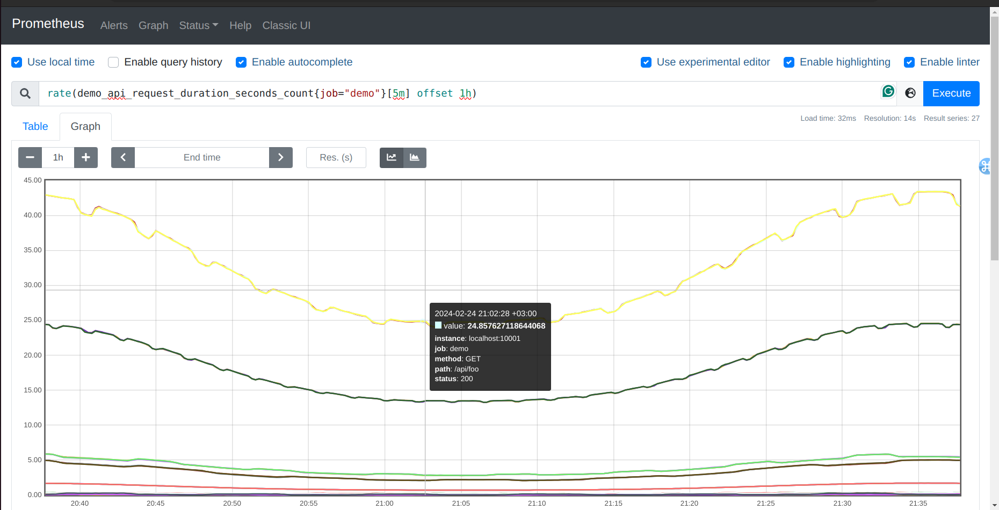
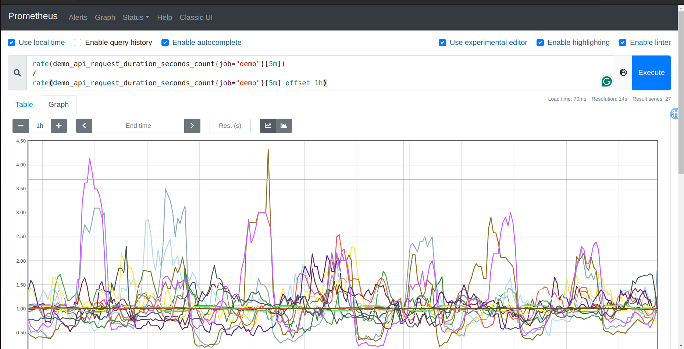

Sometimes you want to compare current system behavior to past behavior in one PromQL expression.
For example, you might want to see what the difference (or ratio) is between the current request rate
and that of a week ago on the same day. To do this, PromQL offers an offset <duration> modifier
that you can add to any series selector, which time-shifts the requested data range into the past. For
example, to get the demo service request rate one hour ago (relative to each evaluation point in the
graph), you can query for:

rate(demo_api_request_duration_seconds_count{job="demo"}[5m] offset 1h)

You could now calculate a ratio between each current rate and the rate one hour ago:

rate(demo_api_request_duration_seconds_count{job="demo"}[5m])
/
rate(demo_api_request_duration_seconds_count{job="demo"}[5m] offset 1h)

Graphing the ratio of current and past request rates

It will look something like this, hovering around 1:

n a real service, you might use an expression like this to get an idea of whether a request rate is
significantly different from the rate at the same time and day of the last week (using offset 7d).
Note that you can only use the offset modifier directly after an instant or range vector selector (foo
or foo[5m]), not after any arbitrary sub-expression.