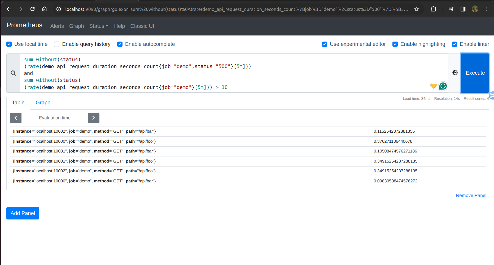
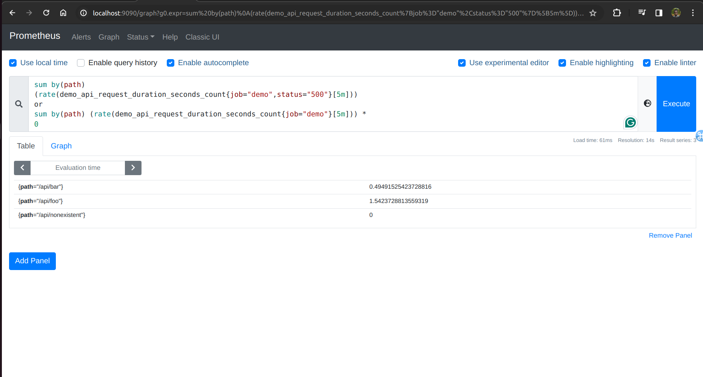

Lab 11.3 - Performing Set Operations
You just learned how to correlate and filter two time series vectors based on their sample values.
Sometimes it can be useful to correlate two series vectors based on the mutual presence of certain
label sets in each of the vectors and modify the output set accordingly. PromQL offers three set
operators for this: and, or, and unless.

The and operator allows you to select only series from a vector that also have an equivalently labeled
series in a second vector (set intersection). This is useful for expressing more complex filter conditions
in queries. For example, to graph the status="500" error rates only for those path, method, and
instance combinations that have a total request rate larger than 10 per second, query for:

sum without(status)
(rate(demo_api_request_duration_seconds_count{job="demo",status="500"}[5m]))
and
sum without(status)
(rate(demo_api_request_duration_seconds_count{job="demo"}[5m])) > 10
This will give you a filtered-down list of error rates:

The or operator allows you to select label sets from two time series vectors which are in either of the
two vectors (set union). Each resulting sample value will be taken from the left-hand side of the
operation if a given label set is present there, and from the right-hand side otherwise. This is often
useful when you are missing certain label combinations in one vector and want to fill them in with
alternative values originating from another vector which you know has all label combinations.
A somewhat contrived example: If you wanted to query the status="500" error rate for all paths that
have ever received HTTP requests (even ones that never encountered a 500 error), you would
typically run into the problem that no series exist at all for those paths that never produced a 500 error
(so you would not see a rate of 0 for these paths, but no series at all). Using the or operator, you can
fill in the paths that have ever handled any requests at all and set their rate value to 0 using a
multiplication trick:

sum by(path)
(rate(demo_api_request_duration_seconds_count{job="demo",status="500"}[5m]))
or
sum by(path) (rate(demo_api_request_duration_seconds_count{job="demo"}[5m])) *
0
You should now also see a 500 rate for the /api/nonexistent path, which only ever results in 404
status codes since it does not exist:

Finally, there is also an unless operator that only propagates label sets from one vector into the
output if they are not found in the second vector (set complement).

