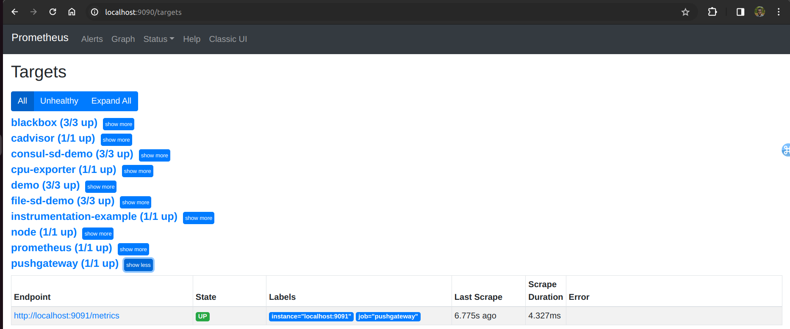

Lab 15.2 - Monitoring the Pushgateway

The Prometheus Pushgateway exists to allow ephemeral and batch jobs to expose their metrics to Prometheus. Since these kinds of jobs may not exist long enough to be scraped, they can instead push their metrics to a Pushgateway. The Pushgateway then exposes these metrics to Prometheus.

The Pushgateway exposes metrics about itself, as well as about the groups of metrics that other jobs
have pushed to it under the /metrics HTTP path. Thus, you can simply scrape it like any other
target.

Add the following list entry to the scrape_configs section in your prometheus.yml to scrape the
Pushgateway:

- job_name: 'pushgateway'
honor_labels: true
static_configs:
- targets: ['localhost:9091']

Note the honor_labels: true scrape option. Because the Pushgateway proxies metrics from other
jobs that usually already attach their own job label to a group of metrics, you will want to prevent
Prometheus from overwriting any such labels with the target labels from the scrape configuration. The
Pushgateway documentation explains this in more detail.

Make sure that Prometheus reloads its configuration file:

killall -HUP prometheus

Head to your Prometheus server's targets page at http://<machine-ip>:9090/targets to verify
that it is scraping the Pushgateway correctly.

