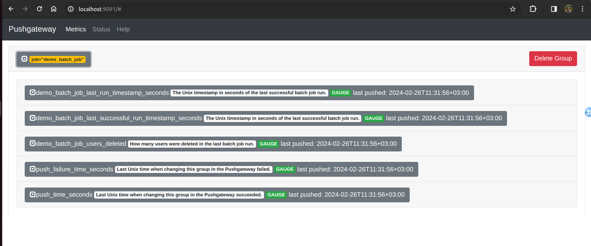

Lab 15.3 - Pushing Metrics from a Batch Job

Rather than deploying a real batch job, let's simulate one using curl. This batch job simulates
deleting a random number of users, and then pushes the timestamp of its last successful run, the
timestamp of its last overall run (successful or not), as well as the number of deleted users to the
Pushgateway. Exposing such timestamps proves to be useful for monitoring and alerting on the overall
health of periodic batch job runs, as you will see later.

Execute a simulated batch job run using the following command:

cat <<EOF | curl --data-binary @-
http://localhost:9091/metrics/job/demo_batch_job
# TYPE demo_batch_job_last_successful_run_timestamp_seconds gauge
# HELP demo_batch_job_last_successful_run_timestamp_seconds The Unix timestamp
in seconds of the last successful batch job run.
demo_batch_job_last_successful_run_timestamp_seconds $(date +%s)
# TYPE demo_batch_job_last_run_timestamp_seconds gauge
# HELP demo_batch_job_last_run_timestamp_seconds The Unix timestamp in seconds
of the last successful batch job run.
demo_batch_job_last_run_timestamp_seconds $(date +%s)
# TYPE demo_batch_job_users_deleted gauge
# HELP demo_batch_job_users_deleted How many users were deleted in the last
batch job run.
demo_batch_job_users_deleted $RANDOM
EOF

Note that the command embeds the $(date +%s) command output above to generate up-to-date
Unix timestamps for the timestamp-based metrics on each run. It also uses the special $RANDOM shell
variable to generate random numbers between 0 and 32767 for the number of deleted users.

Head to http://<machine-ip>:9091/ to verify that the metrics are visible in the Pushgateway's
web interface. There should now be one metrics group with the grouping label

job="demo_batch_job". Click on the group to expand it and view details about its metrics.

Run the above command multiple times to simulate successive runs of the batch job and verify that the
data in the Pushgateway is updated.
