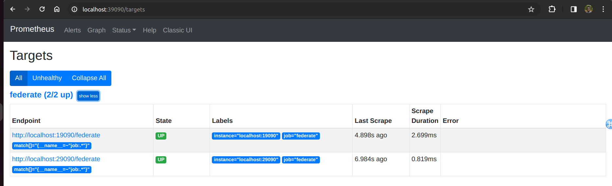
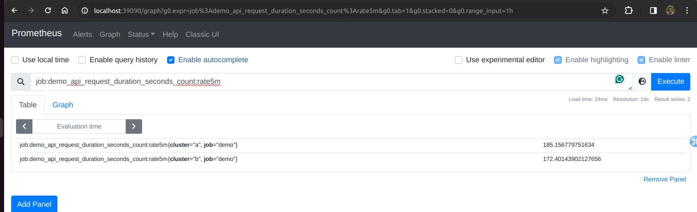

Lab 19.1 - Scaling via Hierarchical Federation

Let’s set up an example of hierarchical federation. Pretend that you have two clusters (although you
really only have one machine to run this lab on), with a local Prometheus server in each cluster. Each
local Prometheus server monitors three demo service instances and uses recording rules to create
per-job aggregated metrics for their cluster. A third, global, Prometheus server uses federation to pull
in those aggregate metrics about both clusters from the per-cluster /federate Prometheus
endpoints. These endpoints return the last value of all series selected via a set of match[] HTTP
parameters and the federating Prometheus then ingests them as normal metrics.
Create two configuration files named prometheus-cluster-a.yml and
prometheus-cluster-b.yml, both with the following content:

Note that you will simply monitor each of the three demo service instances twice for this lab instead of
truly running separate service instances for each cluster.

In separate terminals, start both Prometheus servers with different data directories and ports:

./prometheus \
--config.file=prometheus-cluster-a.yml \
--storage.tsdb.path=data-cluster-a \
--web.listen-address=:19090
…and:

./prometheus \
--config.file=prometheus-cluster-b.yml \
--storage.tsdb.path=data-cluster-b \
--web.listen-address=:29090

Create a file prometheus-global.yml for the federating Prometheus with the following content:

Note the honor_labels: true scrape option. Because the metrics from lower-level Prometheus
servers already include job and instance labels, this prevents Prometheus from overwriting any
such labels with the target labels from the scrape configuration.
In a new terminal, start the global Prometheus server:

./prometheus \
--config.file=prometheus-global.yml \
--storage.tsdb.path=data-global \
--web.listen-address=:39090

Head to the global Prometheus server's graphing view at http://machine-ip:39090/ and verify
that the metric job:demo_api_request_duration_seconds_count:rate5m from both
per-cluster Prometheus servers is queryable and distinguishes metrics from both clusters via a
cluster label.

