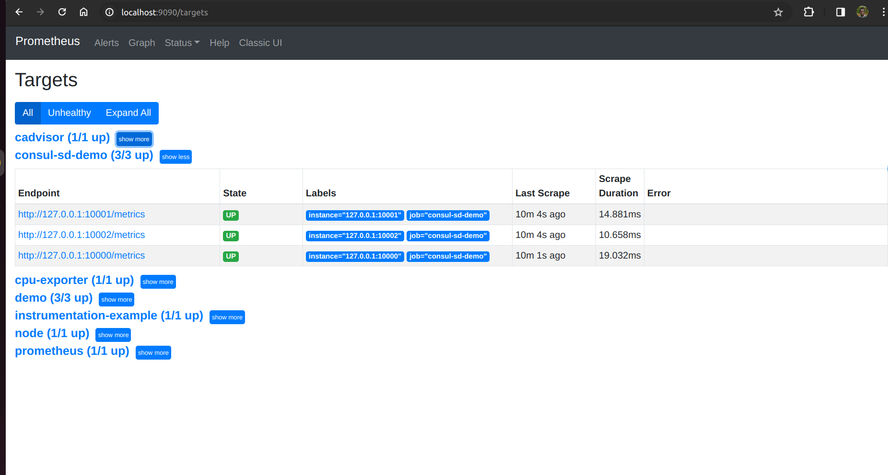

Lab 13.1 - Setting Up Consul-Based Discovery

A common tool that organizations use to register and discover hosts and services is Hashicorp's
Consul. In the following lab, you will use Prometheus's native support for Consul-based service
discovery to monitor your existing three demo service instances.

In a new terminal, change to your home directory and download Consul version 1.9.3:

wget https://releases.hashicorp.com/consul/1.9.3/consul_1.9.3_linux_amd64.zip

Extract the archive:

unzip consul_1.9.3_linux_amd64.zip

This should extract a single binary executable file named consul.
Create a configuration file named demo-service.json in the same directory that defines each of
your three demo service instances for Consul:

Run the Consul agent in development mode while providing the above file as its configuration:

./consul agent -dev -config-file=demo-service.json

In addition to the three demo service targets, the Consul agent will also register itself as a
single-instance service with the name consul.

To make Prometheus discover the demo service targets from Consul, add the following scrape
configuration to the scrape_configs stanza of your prometheus.yml file:

To make Prometheus discover the demo service targets from Consul, add the following scrape
configuration to the scrape_configs stanza of your prometheus.yml file:

- job_name: 'consul-sd-demo'
consul_sd_configs:
- server: 'localhost:8500'
relabel_configs:
- action: keep
source_labels: [__meta_consul_service]
regex: demo

Note that this is also adding a relabeling step to only keep targets where the Consul service name is
demo. Otherwise, Prometheus would try to scrape the Consul agent itself as well, which doesn't have
a /metrics endpoint.

Reload the Prometheus configuration by sending a HUP signal to the Prometheus process:

killall -HUP prometheus

