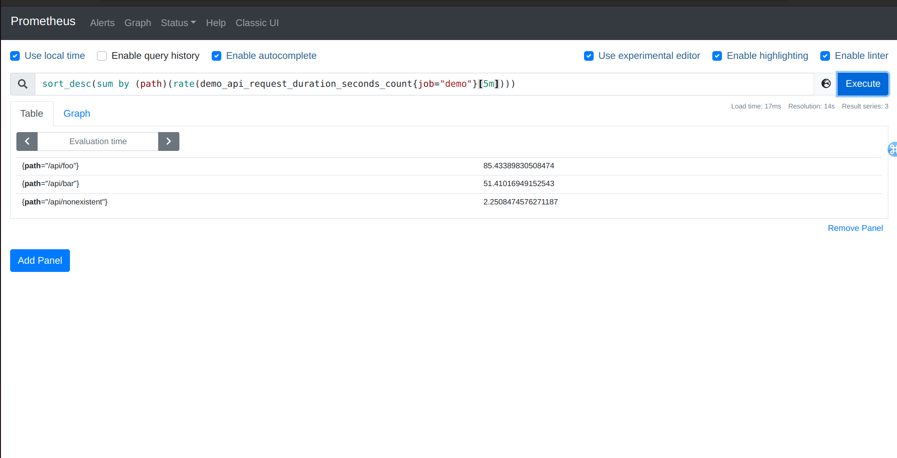
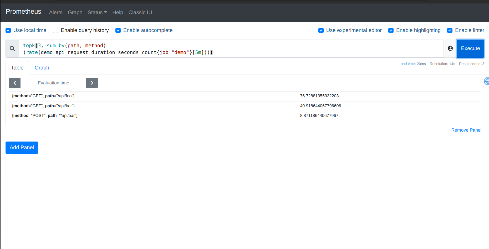

Lab 11.6 - Sorting and Limiting

In the Table view of the expression browser it's sometimes useful to sort query results by their sample
value. For example, you may want to show the total memory usage of every service on a cluster,
sorted descendingly, so you can easily spot the biggest memory users. You can use the sort() or
sort_desc() functions to achieve this. The former sorts ascendingly, while the latter sorts
descendingly.

To see the request rates for each path in our demo service, sorted descendingly by the magnitude of
the rate, query for:

sort_desc(sum by(path)
(rate(demo_api_request_duration_seconds_count{job="demo"}[5m])))

You should give you a sorted result:

Note: Sorting does not have any effect on graphs, since the X and Y values of each series are
determined independently of the order in which each time series is returned in a query result.
To show only a certain number of top k or bottom k results of a query (where k is an integer), you can
use the topk(k, ...) or bottomk(k, ...) aggregation operators. These operators take the
number of output values you want to show as their first parameter and an instant vector expression to
limit as their second parameter.

For example, to show the top 3 request rates for each path and method combination, query for:

topk(3, sum by(path, method)
(rate(demo_api_request_duration_seconds_count{job="demo"}[5m])))

Note: One confusing aspect when graphing topk() or bottomk() is that the total number of series
displayed in the graph can be different from the specified k value. For one, it can show fewer than k
series if there were not enough input series to begin with. Since the entire PromQL expression is also
evaluated independently at every evaluation step of the graph (without any knowledge of the total
range of the graph), it may also return a different set of top or bottom k series at each step in the
graph, in which case you will see more than k series in total.