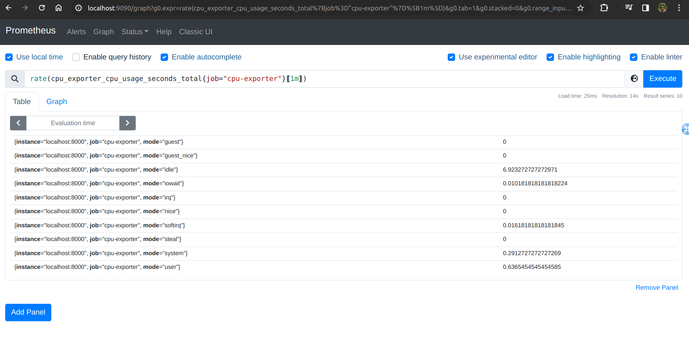

In this lab, you will study and run a simple example exporter written in Python that exposes CPU
metrics about the Linux machine it is running on. These metrics will be roughly equivalent to the CPU
usage metrics of the Node Exporter, although they only split up CPU usage by mode, not additionally
by CPU core. To retrieve the host's CPU metrics, the exporter uses the psutil Python library so that
it does not need to parse the underlying virtual file (/proc/stat) on its own. Writing exporters works
similarly in other languages, but Python allows us to illustrate a much shorter example than in a
language like Go.

First, install the necessary Python dependencies:

export LC_ALL=C
sudo pip install prometheus_client
sudo pip install psutil

Change into your home directory and create a file named cpu_exporter.py with the following
contents:

Start the demo CPU exporter:

python3 cpu_exporter.py

Add the following scrape configuration to the scrape_configs stanza of your prometheus.yml file:

- job_name: 'cpu-exporter'
static_configs:
- targets:
- 'localhost:8000'

Reload the Prometheus configuration by sending an HUP signal to the Prometheus process:

killall -HUP prometheus

The Prometheus server should now automatically start scraping your demo CPU exporter. Head to
your Prometheus server’s status page at http://<machine-ip>:9090/targets and verify that
the targets for the demo job are now showing an UP state.

You can now query CPU usage from your own exporter instead of using the Prometheus Node
Exporter:

rate(cpu_exporter_cpu_usage_seconds_total{job="cpu-exporter"}[1m])

