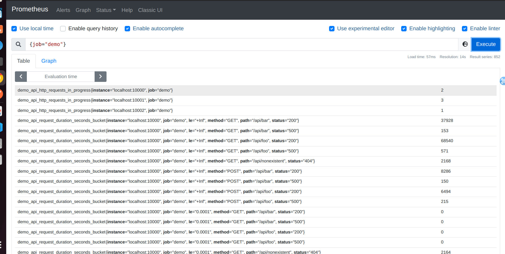

Lab 12.1 - Using Relabeling to Drop Samples

Relabeling is a wide field. Instead of diving in too deep into different relabeling use cases in this
chapter, we will study more examples of relabeling in later chapters, when we learn about blackbox
monitoring, service discovery, alerting, and using Prometheus with Kubernetes.

For now, let's try a simple example in which we will use relabeling to selectively drop some metrics of
the demo service that we do not want to store. The demo service exposes four classes of metrics:

Application-specific metrics, prefixed with demo_.
Go runtime-specific metrics, prefixed with go_.
Generic process metrics, prefixed with process_.
Generic HTTP-level metrics, prefixed with http_.

Let's say you only wanted to store the application-specific and HTTP-level metrics. We could then use
metric relabeling to throw away any samples where the metric name does not start with either demo_
or http_ by matching a regular expression against the special __name__ label that contains a
sample's metric name.

Add the following metric_relabel_configs section to the demo service's scrape_config
section in your prometheus.yml:

metric_relabel_configs:
- action: keep
source_labels: [__name__]
regex: '(demo_|http_).*'

This keeps only the samples whose metric name matches the regular expression (demo_|http_).*
and thus only stores application-level and HTTP-level metrics.
Make sure that Prometheus reloads its configuration file:

killall -HUP prometheus

Query the following expression in the Table view of the Prometheus expression browser:

{job="demo"}

This should now only show series with the expected matching metric names.

Note: Using relabeling on individual samples like this still requires producing and transfering all
samples to the Prometheus server before they can be filtered. If you are using this to filter large groups
of metrics, it is often better to fix the metrics source to only expose the metrics you are interested in.