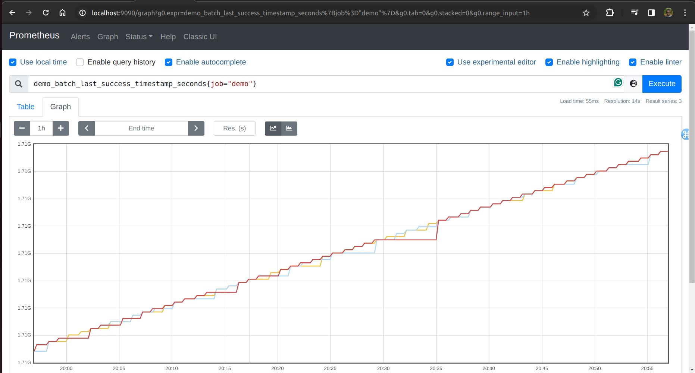
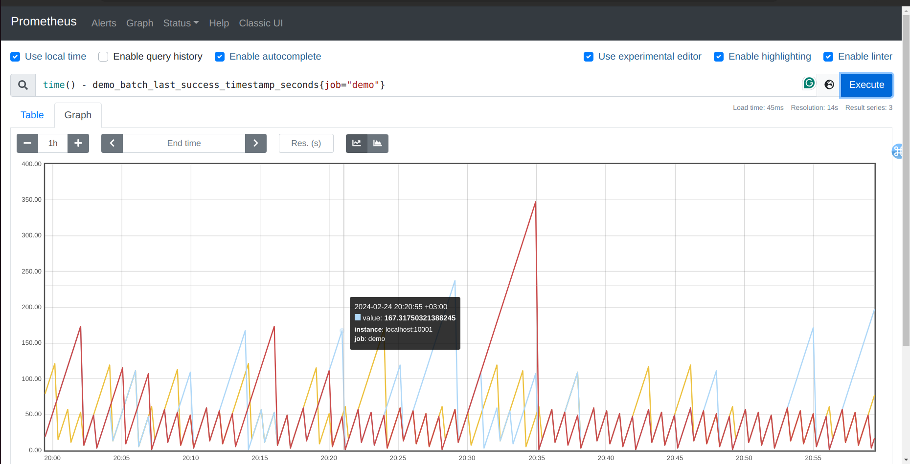
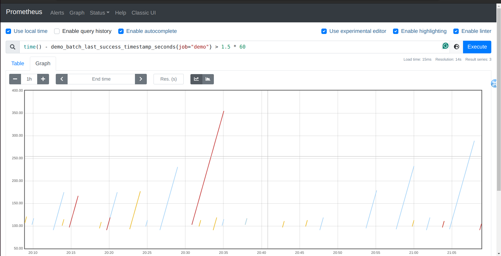

Lab 11.4 - Working with Timestamp Metrics
For tracking the time when some event has happened, services and exporters frequently encode a
Unix timestamp in seconds into the sample value (not the sample timestamp!) of a metric. This could
be the boot time of a machine, the last time a batch job finished a successful run, or when the last
garbage collection cycle happened.
For example, the demo service exposes a metric that tells you when the last successful run of its
internal batch job happened:

demo_batch_last_success_timestamp_seconds{job="demo"}

When you graph this directly, you will see a "staircase" graph in which the timestamp remains constant
for a while and then jumps up every time that the batch job run succeeds:

Graphing the raw timestamp of each last successful batch job run

In monitoring, you are often more interested in the duration since something has happened, rather
than the absolute timestamp. To calculate the age of a timestamp in PromQL, simply subtract the
timestamp metric from the current time as provided by the time() function:

time() - demo_batch_last_success_timestamp_seconds{job="demo"}

This will give you the number of seconds since the last successful batch job run:

This kind of sawtooth graph is easy to analyze with the eye. Lines that go up too far represent batch
jobs which are far overdue, while any drop in a line to 0 represents a successful batch job completion.
Combining this expression with a value threshold allows us to detect batch jobs that have not finished
within the last 1.5 minutes:

time() - demo_batch_last_success_timestamp_seconds{job="demo"} > 1.5 * 60

You could use this kind of filter expression to alert on batch jobs that have not run successfully in a
while.

